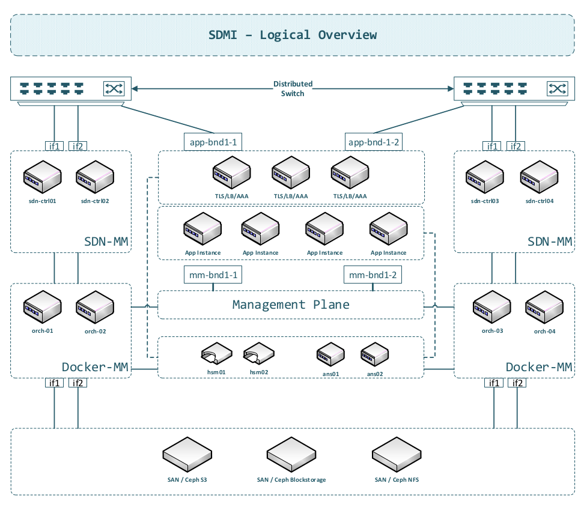
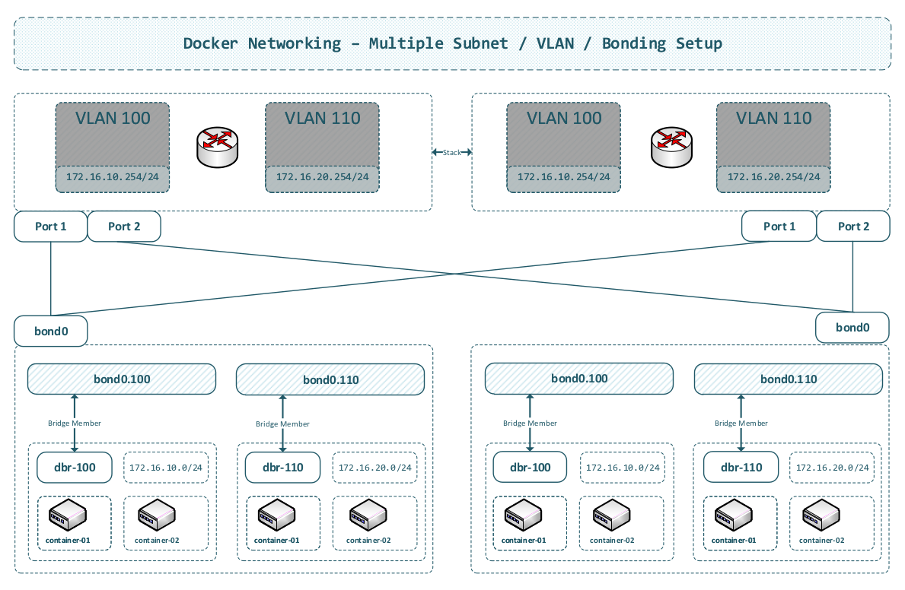

# SDMI (Odyssey)

SDMI - Simple (SDN Driven) Docker Management Instrumentation.

## 1. Abstract

Why does the world need another Docker management instrumentation today?

- Docker management infrastructure (including Compose) increases in complexity over time, whereas it should decrease
- Most frameworks ship with sub-optimal network abstraction layers
- Software Defined Networking (SDN) was never considered an option, despite significantly reducing complexity while also providing nearly 100% reliability
- Management (orchestration plane) often lacks OOP principles
- Systems integration (e.g., metrics) often requires higher-level programming skills

The SDMI (codename Odyssey) addresses these topics and provides:

- A code base that is easy to understand and maintain
- Minimalistic dependencies (preventing inclusion of submodule 289, submodule 290, and so forth)
- Reduced refactoring and update effort when dependent packages are updated
- Reuse of stable, reliable, **and** field-proven mechanisms (SDN) rather than reinventing the wheel

## 2. History

Over multiple decades ago, as the virtualization era was emerging, engineers began developing software-managed platform infrastructure. Massive user growth and increasing service complexity necessitated new solutions.

First, it is important to clarify that Software Defined Networking can be misunderstood. When we primarily speak about SDN, we are referring to the OpenFlow protocol. In some circumstances, people often confuse this terminology with software that controls networking setups (including Linux as a whole).

The SDMI uses **both**: SDN (OpenFlow) and parts of software generated config (NETCONF), but **no** *Linux container or VM-based* network abstraction (OpenStack or similar). Network processing should take place only in rock-solid, field-proven, and standards-compliant Ethernet switch hardware (Cisco Nexus 9000 / Allied Telesis).

Such network abstractions also make it **very difficult** to implement appropriate reliability (single-point-of-failure-free architecture), whereas an SDN-driven approach enables this more effectively.

## 3. Concrete Goals

- Automatic on-demand (latency-less) up/down scaling
- Easy, OOP-based systems integration (orchestration, metrics)
- Rolling updates (with zero downtime)
- Hierarhical (recursive) network dependency management
- Multi-host, datacenter operation and hardware virtual machine abstraction
- Be devops friendly (role based access control)
- Centralized, easy to maintain AAA infrastructure (including PKCS enabled hardware)
- Centralized ANS (DoT) signed zone integration / internal host management

## 4. Architecture

*Architecture description is forthcoming / WIP.*

### 4.1. Overview

### 4.2. Docker Infrastrucure

## 5. Milestones

### 5.1 Basic Network Orchestration - Milestone 1

- Excellent orchestrator OOP abstraction
- Build an example with multi-network dependencies

*Example diagrams are forthcoming.*

The orchestrator's design must be **natively** object-oriented (OOP). Python version 3+ will be used as the programming language.

A *fast*, working orchestrator (non-OOP) implementation (draft) is available here: https://github.com/clauspruefer/python-dbpool/tree/main/example/01-logical-replication and will be used as a template for initial development.

## 6. Sub-Projects

Also, a 100% fail-safe management plane (orchestration) layer needs modern protocol design approaches.

1. RDMP (Reliable Message Distribution Protocol)

To integrate a "in-parallel" acting, "transactional" control message processing, (see: https://www.der-it-pruefer.de/infrastructure/Kubernetes-Control-Plane-Architectural-Challenges#32) we propose the RDMP protocol.

## 7. Engineering Guidelines

The basic engineering guidelines represent the following:

- No closed source
- Only validated external packages (approved code)
- Strict tests (unit, integration, end2end) validating 100% functionality
- Using only clean code / abstraction models
- Avoid code bloating
- Security should play a primary role

### 7.1. Programming Languages

The following porgramming languages are allowed:

- Python (management / orchestration)
- C++ (protocol specific / orchestration)
- JavaScript (frontend systems)
- JavaScript JSON notation (all langueages)

### 7.2. External Package Inclusion

- Only packages following a generic OOP approach allowed
- Package content (code) must be validated personally
- Only use external packages when really necessarry
- External package codebase should be small, übersichtlich
- External packages should only cope with

> [!NOTE]
> In some minor special cases, e.g. python `ipcalc` package is non-OOP but does exactly (and not more) what it should do.

## 8. Basic Dependencies

- Docker - https://www.docker.com
- Python Micro-ESB - https://github.com/clauspruefer/python-micro-esb
- SimpleRPCSocket (JSocket fork) - https://github.com/clauspruefer/python-json-socket
- libvirt (Docker VirtualMachine encapsulation) - https://libvirt.org

### 8.1. Extended Dependencies

- PowerDNS (signed ANS zones) - https://www.powerdns.com
- MongoDB (NoSQL backend) - https://www.mongodb.com
- PostgreSQL (SQL backend) - https://www.postgresql.org
